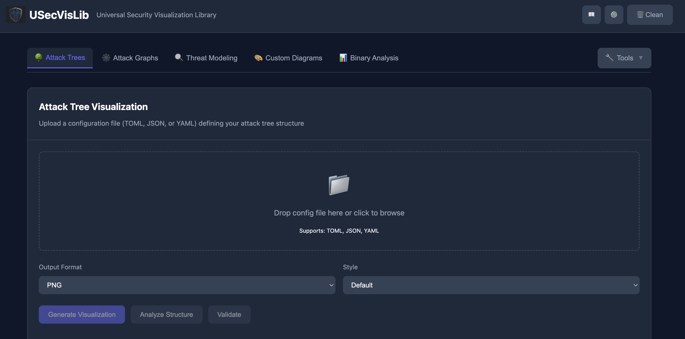
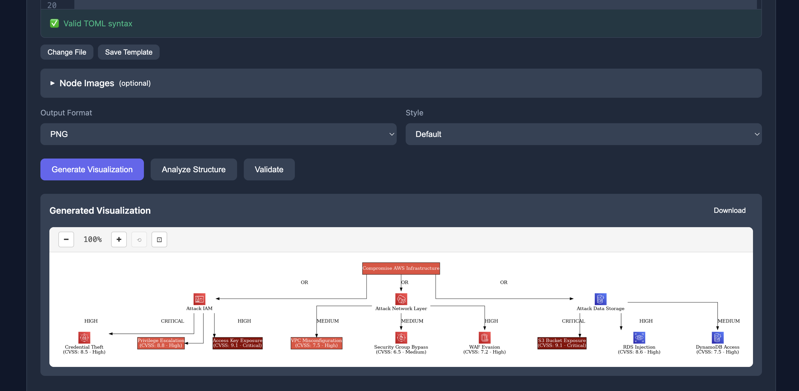
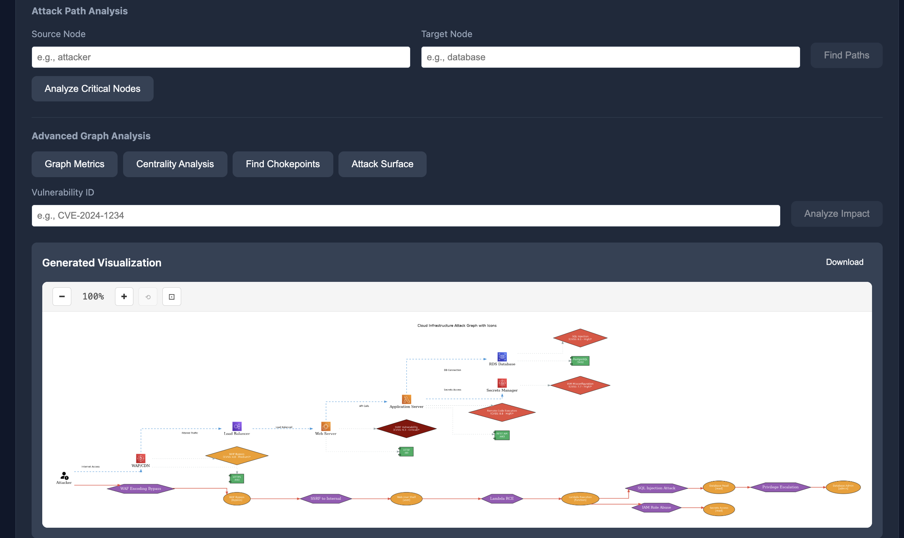
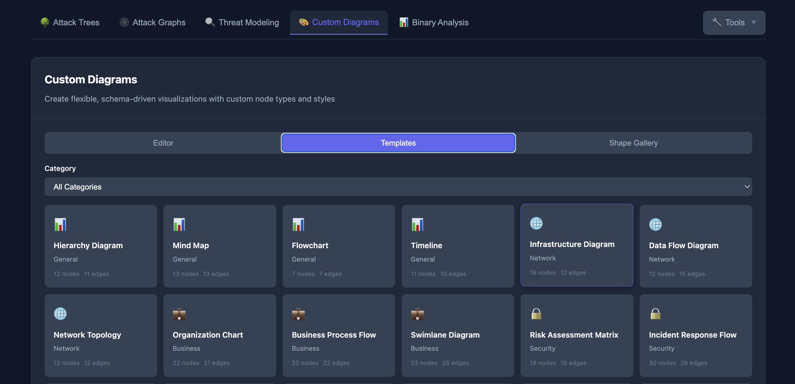
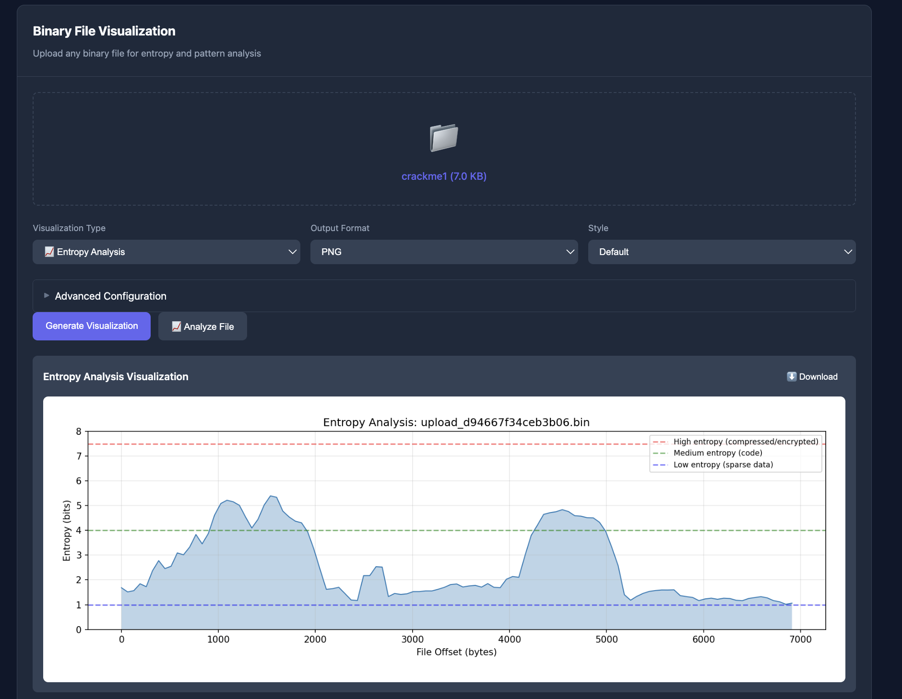

<p align="center">
  
</p>

<h1 align="center">Universal Security Visualization Library</h1>

[](https://opensource.org/licenses/Apache-2.0)
[](https://python.org)
[](https://vuejs.org)
[](https://fastapi.tiangolo.com)

A comprehensive Python library and web application for creating security visualizations including attack trees, attack graphs, threat models, and binary analysis diagrams.



## Features

### Visualization Modules

| Module | Description | Key Features |
|--------|-------------|--------------|
| **Attack Trees** | Hierarchical attack scenario diagrams | AND/OR gates, leaf nodes, 13 style presets |
| **Attack Graphs** | Network attack path visualization | Path finding, critical node analysis, CVSS scoring |
| **Threat Modeling** | Data Flow Diagrams with STRIDE analysis | PyTM integration, report generation, trust boundaries |
| **Binary Analysis** | Binary file pattern visualization | Entropy, byte distribution, wind rose, heatmap |
| **Custom Diagrams** | Flexible schema-driven diagrams | 100+ shapes, 20+ templates, custom schemas |

### Platform Features

- **REST API** - FastAPI-based API with OpenAPI documentation
- **Web Frontend** - Vue.js 3 application with dark theme UI ([UI Guide](docs/UI_GUIDE.md))
- **Multi-Format Support** - TOML, JSON, and YAML configuration files
- **Format Conversion** - Convert between configuration formats (including Mermaid export)
- **Mermaid Export** - Export visualizations to Mermaid diagram syntax for docs and wikis
- **Docker Support** - Containerized deployment ready
- **OWASP PyTM Integration** - Industry-standard threat modeling
- **Zoomable Visualizations** - Pan and zoom controls on all images
- **Live Editor** - Syntax highlighting with real-time validation

## Screenshots

### Attack Trees


### Attack Graphs


### Threat Modeling


### Custom Diagrams


### Binary Analysis


## Web UI Features

The web interface provides an intuitive way to create visualizations:

### Navigation
- **Primary Tabs**: Attack Trees, Attack Graphs, Threat Modeling, Custom Diagrams, Binary Analysis
- **Tools Menu**: CVSS Calculator, Format Converter, Batch Processing, Export, Compare
- **Header Actions**: Documentation, Settings, Clean/Reset

### Key Features
- Drag-and-drop file upload
- Live code editor with syntax highlighting
- Real-time configuration validation
- Zoomable visualization output
- CVSS display controls (toggle per visualization type)
- Responsive design for mobile devices

See the [UI Guide](docs/UI_GUIDE.md) for detailed documentation.

For Custom Diagrams, see the [Custom Diagrams Guide](docs/CUSTOM_DIAGRAMS_GUIDE.md).

## Installation

### Quick Start with Docker

```bash
# Clone the repository (with submodules for Bootstrap icons)
git clone --recursive https://github.com/vulnex/usecvislib.git
cd usecvislib

# If you already cloned without --recursive, initialize submodules:
# git submodule update --init --recursive

# Start with Docker Compose
docker-compose up -d

# Access the web UI at http://localhost:3001
# API documentation at http://localhost:8000/docs
```

### Manual Installation

```bash
# Clone the repository (with submodules for Bootstrap icons)
git clone --recursive https://github.com/vulnex/usecvislib.git
cd usecvislib

# If you already cloned without --recursive, initialize submodules:
# git submodule update --init --recursive

# Create virtual environment
python -m venv venv
source venv/bin/activate  # On Windows: venv\Scripts\activate

# Install Python dependencies
pip install -r requirements.txt

# Install the package
pip install -e .

# Install frontend dependencies
cd frontend
npm install
cd ..
```

### System Requirements

- Python 3.8+
- Node.js 18+ (for frontend)
- Graphviz (for graph rendering)

```bash
# macOS
brew install graphviz

# Ubuntu/Debian
sudo apt-get install graphviz

# Windows
choco install graphviz
```

### Optional: OWASP PyTM

For advanced threat modeling with PyTM integration:

```bash
pip install pytm
```

## Usage

### Web Application

```bash
# Start the API server
cd api
uvicorn main:app --reload --port 8000

# In another terminal, start the frontend
cd frontend
npm run dev

# Open http://localhost:3000 in your browser
```

### Command Line Interface

```bash
# Attack Tree
usecvis -m 0 -i config.toml -o output -f png -s at_default

# Attack Graph
usecvis -m 3 -i network.toml -o graph -f png -s ag_security

# Threat Model with STRIDE report
usecvis -m 1 -i threat.toml -o diagram -f png -r

# Binary Analysis (all visualizations)
usecvis -m 2 -i binary.exe -o analysis -v all

# Custom Diagram
usecvis -m 4 -i diagram.toml -o output -f png -s cd_default

# Format Conversion (including Mermaid export)
usecvis -i attack.toml -o output --convert json
usecvis -i threat.yaml -o diagram --convert mermaid
```

### Python API

```python
from usecvislib import AttackTrees, AttackGraphs, ThreatModeling, BinVis, CustomDiagrams

# Attack Trees
at = AttackTrees("attack.toml", "output", format="png", styleid="at_neon")
at.BuildAttackTree()
stats = at.get_tree_stats()

# Attack Graphs
ag = AttackGraphs("network.toml", "graph", format="png", styleid="ag_security")
ag.BuildAttackGraph()
paths = ag.find_attack_paths("attacker", "database_root")
critical = ag.analyze_critical_nodes(top_n=5)

# Threat Modeling
tm = ThreatModeling("threat.toml", "dfd", format="png", engine="pytm")
tm.BuildThreatModel()
threats = tm.analyze_stride()
tm.generate_stride_report("report.md")

# Binary Visualization
bv = BinVis("binary.exe", "analysis", format="png")
bv.BuildBinVis("all")
stats = bv.get_file_stats()

# Custom Diagrams
cd = CustomDiagrams()
cd.load("diagram.toml")
result = cd.BuildCustomDiagram(output="diagram", format="png")
stats = cd.get_stats()

# Mermaid Export
from usecvislib import serialize_to_mermaid, detect_visualization_type
from usecvislib.utils import ReadConfigFile

config = ReadConfigFile("attack.toml")
vis_type = detect_visualization_type(config)
mermaid_text = serialize_to_mermaid(config, diagram_type=vis_type)
```

## Configuration Formats

All modules support TOML, JSON, and YAML configuration files. Format is auto-detected from file extension.

### Attack Tree Example (TOML)

```toml
[tree]
name = "Web Application Attack"
root = "Compromise App"
params = { rankdir = "TB" }

[nodes]
"Compromise App" = { style = "filled", fillcolor = "red" }
"SQL Injection" = { style = "filled", fillcolor = "orange" }
"XSS Attack" = { style = "filled", fillcolor = "orange" }

[edges]
"Compromise App" = [
  { to = "SQL Injection", label = "OR" },
  { to = "XSS Attack", label = "OR" }
]
```

### Attack Graph Example (TOML)

```toml
[graph]
name = "Corporate Network"
description = "Attack paths through corporate infrastructure"

[[hosts]]
id = "attacker"
label = "External Attacker"
zone = "external"

[[hosts]]
id = "webserver"
label = "Web Server"
ip = "10.0.1.10"
zone = "dmz"

[[vulnerabilities]]
id = "cve_2024_1234"
label = "CVE-2024-1234"
cvss = 9.8
affected_host = "webserver"

[[exploits]]
id = "exploit_web"
label = "Exploit Web RCE"
vulnerability = "cve_2024_1234"
precondition = "attacker"
postcondition = "web_shell"
```

### Threat Model Example (TOML)

```toml
[model]
name = "E-Commerce Platform"
description = "Online shopping system"

[externals.customer]
label = "Customer"

[processes.webserver]
label = "Web Server"
authenticatesSource = true
sanitizesInput = true

[datastores.userdb]
label = "User Database"
isEncrypted = true
isSQL = true

[dataflows.login]
from = "customer"
to = "webserver"
label = "HTTPS Login"
isEncrypted = true

[boundaries.dmz]
label = "DMZ"
elements = ["webserver"]
```

### Custom Diagram Example (TOML)

```toml
[diagram]
title = "System Architecture"
layout = "hierarchical"
direction = "TB"
style = "cd_default"

[schema.nodes.server]
shape = "server"
required_fields = ["name", "ip"]
style = { fillcolor = "#3498DB", fontcolor = "white" }

[schema.nodes.database]
shape = "database"
required_fields = ["name"]
style = { fillcolor = "#27AE60", fontcolor = "white" }

[schema.edges.connection]
style = "solid"
arrowhead = "normal"

[[nodes]]
id = "web"
type = "server"
name = "Web Server"
ip = "10.0.1.10"

[[nodes]]
id = "db"
type = "database"
name = "PostgreSQL"

[[edges]]
from = "web"
to = "db"
type = "connection"
label = "SQL"
```

## Available Styles

### Attack Trees (13 styles)
`at_default`, `at_white_black`, `at_black_white`, `at_corporate`, `at_neon`, `at_pastel`, `at_forest`, `at_fire`, `at_blueprint`, `at_sunset`, `at_hacker`, `at_minimal`, `at_plain`

### Attack Graphs (10 styles)
`ag_default`, `ag_dark`, `ag_security`, `ag_network`, `ag_minimal`, `ag_neon`, `ag_corporate`, `ag_hacker`, `ag_blueprint`, `ag_plain`

### Threat Models (12 styles)
`tm_default`, `tm_stride`, `tm_dark`, `tm_corporate`, `tm_neon`, `tm_minimal`, `tm_ocean`, `tm_sunset`, `tm_forest`, `tm_blueprint`, `tm_hacker`, `tm_plain`

### Binary Visualization (12 styles)
`bv_default`, `bv_dark`, `bv_security`, `bv_ocean`, `bv_forest`, `bv_sunset`, `bv_cyber`, `bv_minimal`, `bv_corporate`, `bv_fire`, `bv_purple`, `bv_rainbow`

### Custom Diagrams (9 styles)
`cd_default`, `cd_dark`, `cd_corporate`, `cd_neon`, `cd_minimal`, `cd_blueprint`, `cd_hacker`, `cd_pastel`, `cd_plain`

## REST API

The FastAPI-based REST API provides programmatic access to all features.

### Endpoints

| Category | Endpoint | Method | Description |
|----------|----------|--------|-------------|
| **Health** | `/health` | GET | API status and version |
| **Attack Trees** | `/visualize/attack-tree` | POST | Generate visualization |
| | `/analyze/attack-tree` | POST | Get statistics |
| | `/validate/attack-tree` | POST | Validate structure |
| **Attack Graphs** | `/visualize/attack-graph` | POST | Generate visualization |
| | `/analyze/attack-graph` | POST | Get statistics |
| | `/analyze/attack-paths` | POST | Find attack paths |
| | `/analyze/critical-nodes` | POST | Identify critical nodes |
| **Threat Models** | `/visualize/threat-model` | POST | Generate DFD |
| | `/analyze/stride` | POST | STRIDE analysis |
| | `/report/threat-model` | POST | Generate report |
| **Binary** | `/visualize/binary` | POST | Generate visualization |
| | `/analyze/binary` | POST | Get file statistics |
| **Custom Diagrams** | `/visualize/custom-diagram` | POST | Generate custom diagram |
| | `/analyze/custom-diagram` | POST | Get diagram statistics |
| | `/custom-diagrams/shapes` | GET | List available shapes |
| | `/custom-diagrams/templates` | GET | List available templates |
| **Utilities** | `/convert` | POST | Convert formats |
| | `/styles` | GET | List available styles |
| | `/templates` | GET | List templates |

### API Documentation

Interactive API documentation is available at:
- Swagger UI: `http://localhost:8000/docs`
- ReDoc: `http://localhost:8000/redoc`

## Project Structure

```
usecvislib/
├── src/usecvislib/           # Python library
│   ├── __init__.py           # Package exports
│   ├── usecvis.py            # CLI entry point
│   ├── attacktrees.py        # Attack tree module
│   ├── attackgraphs.py       # Attack graph module
│   ├── threatmodeling.py     # Threat modeling module
│   ├── binvis.py             # Binary visualization module
│   ├── customdiagrams.py     # Custom diagrams module
│   ├── shapes/               # Shape gallery system
│   ├── schema/               # Schema validation
│   ├── utils.py              # Utility functions
│   └── models/               # Style configurations
├── api/                      # FastAPI REST API
│   ├── main.py               # API application
│   └── schemas.py            # Pydantic models
├── frontend/                 # Vue.js web application
│   ├── src/
│   │   ├── App.vue           # Main application
│   │   ├── components/       # Vue components
│   │   ├── services/         # API services
│   │   └── utils/            # Utilities
│   └── package.json
├── templates/                # Example templates
│   ├── attack-trees/
│   ├── attack-graphs/
│   ├── threat-models/
│   └── custom-diagrams/
├── tests/                    # Unit tests (490+ tests)
├── docker-compose.yml        # Docker Compose config
├── Dockerfile                # Docker image
├── requirements.txt          # Python dependencies
└── setup.py                  # Package setup
```

## Testing

```bash
# Run all tests
pytest tests/ -v

# Run with coverage
pytest tests/ --cov=usecvislib --cov-report=html

# Run specific module tests
pytest tests/test_attackgraphs.py -v
```

## Docker Deployment

```bash
# Ensure submodules are initialized (required for Bootstrap icons)
git submodule update --init --recursive

# Copy environment template and configure
cp .env.example .env
# Edit .env to set your API key

# Build and start services
docker-compose up -d

# View logs
docker-compose logs -f

# Stop services
docker-compose down
```

### Environment Variables

| Variable | Default | Description |
|----------|---------|-------------|
| `USECVISLIB_AUTH_ENABLED` | false | Enable/disable API authentication (enable for production!) |
| `USECVISLIB_API_KEY` | (none) | API key for authentication |
| `USECVISLIB_API_KEYS` | (none) | Multiple API keys (comma-separated) |
| `LOG_LEVEL` | INFO | Logging level |
| `ALLOWED_ORIGINS` | localhost:3000,3001 | CORS origins |
| `RATE_LIMIT_VISUALIZE` | 10/minute | Visualization rate limit |
| `RATE_LIMIT_ANALYZE` | 20/minute | Analysis rate limit |
| `API_ROOT_PATH` | "" | API root path for proxies |

## API Authentication

The API supports optional key-based authentication. **Authentication is disabled by default** for easy setup. For production deployments, enable authentication by setting `USECVISLIB_AUTH_ENABLED=true` and configuring an API key.

When enabled, all endpoints require an `X-API-Key` header.

### Quick Setup

```bash
# Generate an API key
python -c "import secrets; print(f'usecvis_{secrets.token_urlsafe(32)}')"

# Start with authentication
export USECVISLIB_API_KEY=your-generated-key
python -m uvicorn api.main:app --port 8000

# Or disable for local development
USECVISLIB_AUTH_ENABLED=false python -m uvicorn api.main:app
```

### Making Requests

```bash
curl -H "X-API-Key: your-key" http://localhost:8000/health
```

### Frontend Configuration

1. Open Settings (gear icon)
2. Enter your API key in the "API Authentication" section
3. Click "Save API Key"

See [CLI Guide](docs/CLI_GUIDE.md#running-the-rest-api-server) for more details.

## Security Features

- **API Authentication** - Optional API key-based authentication with multiple key support
- **Input Validation** - All user input is sanitized
- **Rate Limiting** - Configurable rate limits per endpoint
- **Security Headers** - CSP, X-Frame-Options, X-Content-Type-Options
- **File Size Limits** - 1MB for configs, 50MB for binaries
- **CORS Protection** - Configurable allowed origins
- **Temp File Cleanup** - Automatic cleanup of temporary files

## Contributing

Contributions are welcome! Please feel free to submit a Pull Request.

1. Fork the repository
2. Create your feature branch (`git checkout -b feature/amazing-feature`)
3. Commit your changes (`git commit -m 'Add amazing feature'`)
4. Push to the branch (`git push origin feature/amazing-feature`)
5. Open a Pull Request

## License

This project is licensed under the Apache License 2.0 - see the [LICENSE](LICENSE) file for details.

## Author

**Simon Roses Femerling** - [VULNEX](https://www.vulnex.com)

## Acknowledgments

### Core Technologies

- [Graphviz](https://graphviz.org/) - Graph visualization software
- [OWASP PyTM](https://github.com/OWASP/pytm) - Threat modeling framework
- [FastAPI](https://fastapi.tiangolo.com/) - Modern web framework
- [Vue.js](https://vuejs.org/) - Progressive JavaScript framework
- [CodeMirror](https://codemirror.net/) - Code editor component
- [NetworkX](https://networkx.org/) - Network analysis library
- [Matplotlib](https://matplotlib.org/) - Plotting library for binary visualization

### Icon Libraries

We gratefully acknowledge the following icon libraries included in this project:

| Library | Source | License |
|---------|--------|---------|
| **AWS Architecture Icons** | [aws-icons.com](https://aws-icons.com/) | AWS Terms |
| **Azure Architecture Icons** | [Microsoft Learn](https://learn.microsoft.com/en-us/azure/architecture/icons/) | Microsoft Terms |
| **Bootstrap Icons** | [icons.getbootstrap.com](https://icons.getbootstrap.com/) | MIT License |

### Additional Credits

- [smol-toml](https://github.com/squirrelchat/smol-toml) - TOML parser for JavaScript
- [js-yaml](https://github.com/nodeca/js-yaml) - YAML parser for JavaScript
- [Mermaid](https://mermaid.js.org/) - Diagramming and charting tool (export format)

---

**VULNEX** - Universal Security Visualization Library v0.3.2
