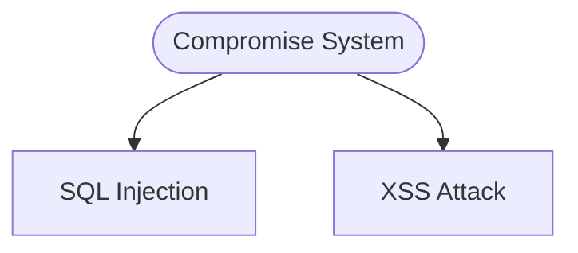

# USecVisLib Web UI Guide

**Version:** 0.3.2

This guide covers the web-based user interface for USecVisLib.

## Overview

The USecVisLib web application provides an intuitive interface for creating security visualizations. It connects to the FastAPI backend and offers all the same features available through the CLI and Python API.

## Accessing the Web UI

```bash
# Start the API server
cd api
uvicorn main:app --reload --port 8000

# Start the frontend (in another terminal)
cd frontend
npm run dev

# Open http://localhost:3000 in your browser
```

Or with Docker:
```bash
docker-compose up -d
# Open http://localhost:3000
```

## Navigation Structure

The UI is organized into three main areas:

### Header Bar

Located at the top of the screen:

| Element | Icon | Description |
|---------|------|-------------|
| Logo | Shield | USecVisLib branding and title |
| Tagline | - | "Universal Security Visualization Library" |
| Documentation | Book | Opens the documentation panel |
| Settings | Gear | Opens application settings |
| Clean | Trash | Resets all visualization panels |

### Primary Tabs

The main navigation tabs for visualization modules:

| Tab | Icon | Description |
|-----|------|-------------|
| **Attack Trees** | Tree | Create hierarchical attack scenario diagrams |
| **Attack Graphs** | Web | Visualize network attack paths |
| **Threat Modeling** | Magnifier | Build Data Flow Diagrams with STRIDE |
| **Binary Analysis** | Chart | Analyze binary file patterns |
| **Custom Diagrams** | Chart | Create user-defined diagrams with custom schemas |

### Tools Dropdown

Click the "Tools" button to access utility features:

| Tool | Icon | Description |
|------|------|-------------|
| **CVSS Calculator** | Target | Calculate CVSS 3.x scores from vectors |
| **Format Converter** | Refresh | Convert between TOML, JSON, YAML, and Mermaid |
| **Batch Processing** | Package | Process multiple files at once |
| **Data Export** | Upload | Export data to JSON, CSV, YAML, Markdown, or Mermaid |
| **File Compare** | Split | Compare two configuration files |

---

## Tools Reference

### CVSS Calculator

Calculate CVSS 3.x scores interactively.

**Usage:**
1. Select metric values using the dropdowns or buttons
2. Score calculates automatically in real-time
3. Vector string is generated (e.g., `CVSS:3.1/AV:N/AC:L/PR:N/UI:N/S:U/C:H/I:H/A:H`)
4. Copy the vector or score to clipboard

**Metrics:**
- **Attack Vector (AV)**: Network, Adjacent, Local, Physical
- **Attack Complexity (AC)**: Low, High
- **Privileges Required (PR)**: None, Low, High
- **User Interaction (UI)**: None, Required
- **Scope (S)**: Unchanged, Changed
- **Confidentiality (C)**: None, Low, High
- **Integrity (I)**: None, Low, High
- **Availability (A)**: None, Low, High

**Severity Ranges:**
| Score | Severity | Color |
|-------|----------|-------|
| 9.0-10.0 | Critical | Dark Red |
| 7.0-8.9 | High | Red |
| 4.0-6.9 | Medium | Orange |
| 0.1-3.9 | Low | Green |
| 0.0 | None | Blue |

---

### Format Converter

Convert configuration files between TOML, JSON, YAML, and Mermaid formats.

**Usage:**
1. Upload a configuration file (TOML, JSON, or YAML)
2. Source format is auto-detected
3. Select target format from dropdown
4. Click "Convert"
5. Preview the converted content
6. Download or copy to clipboard

**Supported Conversions:**
- TOML → JSON, YAML, Mermaid
- JSON → TOML, YAML, Mermaid
- YAML → TOML, JSON, Mermaid

**Mermaid Export:**
- Mermaid is an **output-only** format (cannot be used as input)
- Output files use `.mmd` extension
- Visualization type is auto-detected (attack tree, threat model, attack graph)
- Mermaid syntax can be rendered in:
  - GitHub/GitLab markdown files
  - VS Code with Mermaid extension
  - Documentation tools (Docusaurus, MkDocs)
  - Online Mermaid Live Editor

**Example Mermaid Output:**


---

### Batch Processing

Process multiple configuration files at once.

**Usage:**
1. Drag & drop multiple files (up to 20)
2. Select visualization mode (Attack Tree, Attack Graph, Threat Model, Binary)
3. Choose output format and style
4. Enable "Collect Statistics" for aggregate stats
5. Click "Process All Files"
6. Download individual results or "Download All"

**Features:**
- Progress bar during processing
- Success/failure indicators per file
- Aggregate statistics (total nodes, edges, CVSS averages)
- Error messages for failed files

---

### Data Export

Export configuration data to various formats for reporting.

**Usage:**
1. Upload a configuration file
2. View detected sections (hosts, vulnerabilities, nodes, etc.)
3. Select export format (JSON, CSV, YAML, Markdown, Mermaid)
4. For CSV/Markdown, optionally select a specific section
5. Enable "Include Statistics" for metadata
6. Click "Export Data"
7. Preview and download

**Export Formats:**
| Format | Best For | Notes |
|--------|----------|-------|
| JSON | Programmatic use | Full structure preserved |
| CSV | Spreadsheets | One section at a time |
| YAML | Human readability | Clean, readable format |
| Markdown | Documentation | Tables for reports |
| Mermaid | Diagrams in docs | .mmd syntax for rendering |

**Mermaid Export:**
- Converts visualization data to Mermaid diagram syntax
- Auto-detects visualization type (attack tree, threat model, attack graph)
- Output can be embedded in GitHub/GitLab README files
- Compatible with documentation tools and Mermaid Live Editor

---

### File Compare

Compare two configuration files to track changes.

**Usage:**
1. Upload the original (old) file
2. Upload the modified (new) file
3. Enable "Generate Markdown Report" if needed
4. Click "Compare Files"
5. Review the diff results
6. Download the report

**Change Types:**
| Type | Color | Symbol |
|------|-------|--------|
| Added | Green | + |
| Removed | Red | - |
| Modified | Yellow | ~ |

**Features:**
- Deep comparison of nested structures
- Smart list matching using ID fields
- Path display (e.g., `hosts.webserver.ip`)
- Old/new value preview
- Summary statistics
- Downloadable Markdown report

---

## Panel Components

Each visualization panel contains:

### Input Section

1. **File Upload Area**
   - Drag & drop files
   - Click to browse
   - Supports TOML, JSON, and YAML files

2. **Code Editor**
   - Syntax highlighting for TOML/JSON/YAML
   - Real-time validation
   - Line numbers
   - Error indicators

3. **Options Row**
   - Output format selector (PNG, SVG, PDF)
   - Style preset selector
   - Additional module-specific options

4. **Action Buttons**
   - Visualize - Generate the diagram
   - Analyze - Get statistics
   - Validate - Check configuration syntax
   - Download - Save the generated image

### Output Section

1. **Visualization Display**
   - Zoomable image viewer
   - Pan controls
   - Fit-to-screen button

2. **Statistics Panel**
   - Node/edge counts
   - CVSS statistics
   - Module-specific metrics

3. **Analysis Results**
   - Validation status
   - STRIDE analysis (threat models)
   - Attack paths (attack graphs)

## Node Icons and Images

USecVisLib supports adding icons and images to nodes in Attack Trees, Attack Graphs, and Threat Models.

### Using Bundled Icons

The library includes 3000+ bundled icons organized by provider:

| Provider | Description | Examples |
|----------|-------------|----------|
| **AWS** | AWS architecture icons | EC2, S3, Lambda, RDS, VPC, CloudFront |
| **Azure** | Microsoft Azure icons | VM, Blob Storage, Functions, SQL Database |
| **Bootstrap** | General-purpose icons | Server, Database, Shield, Lock, User |

**Icon Syntax:**

Use the `@icon:` prefix followed by the path within the icons folder:

```toml
[nodes]
WebServer = { label = "Web Server", image = "@icon:aws/compute/ec2.png" }
Database = { label = "Database", image = "@icon:aws/database/rds.png" }
Firewall = { label = "Firewall", image = "@icon:bootstrap/shield.svg" }
```

### Using Custom Images

You can also use custom images with absolute or relative file paths:

```toml
[nodes]
CustomNode = { label = "My Node", image = "/path/to/custom-icon.png" }
```

### Icon Behavior

When a node has an `image` attribute:
- By default, node shape is set to `shape="none"` (no background)
- Image appears above the node label
- Font color is automatically set to black for readability
- User-specified fontcolor in templates takes precedence

### Adding Background Shapes to Icon Nodes

If you want to display both an icon and a background shape (e.g., a colored box behind the icon), explicitly set the `shape` attribute in your configuration:

```toml
[nodes]
"Web Server" = {
    image = "@icon:aws/compute/ec2.png",
    shape = "box",           # Explicitly set shape to keep it
    style = "filled",
    fillcolor = "#3498db"
}
```

When `shape` is explicitly set, the icon appears at the top-center of the node while the background shape remains visible.

### Icon-Enabled Templates

Several templates include icons by default:
- `network_infrastructure_with_icons.tml` - Network topology with device icons
- `aws_cloud_security.tml` - AWS architecture with service icons

Templates with icons have `_with_icons` in their filename. Non-icon versions are also available for comparison.

---

## Advanced Graph Analysis (Attack Graphs)

The Attack Graphs panel includes advanced analysis features powered by NetworkX:

### Available Analysis Types

| Feature | Button | Description |
|---------|--------|-------------|
| **Graph Metrics** | Graph Metrics | Density, diameter, cycles, SCCs, DAG status |
| **Centrality** | Centrality Analysis | Betweenness, closeness, and PageRank rankings |
| **Chokepoints** | Find Chokepoints | Critical bottleneck nodes |
| **Attack Surface** | Attack Surface | Entry points with reachability scores |
| **Vulnerability Impact** | Analyze Impact | Impact score for a specific vulnerability |

### Using Advanced Analysis

1. **Upload an attack graph configuration** (TOML, JSON, or YAML)
2. **Scroll to "Advanced Graph Analysis"** section
3. **Click any analysis button** to run that analysis
4. **View results** in the corresponding results panel below

### Understanding Results

#### Graph Metrics
- **Density**: How connected the graph is (0-1)
- **Diameter**: Longest shortest path between any two nodes
- **Cycles**: Number of circular paths (should be 0 for DAGs)
- **SCCs**: Strongly connected components count
- **Is DAG**: Whether the graph is a Directed Acyclic Graph

#### Centrality Rankings
- **B (Betweenness)**: How often a node appears on shortest paths
- **C (Closeness)**: How close a node is to all others
- **PR (PageRank)**: Node importance based on incoming links

#### Chokepoints
- Nodes marked **CRITICAL** have the highest betweenness scores
- In/Out degrees show connectivity
- Securing chokepoints disrupts multiple attack paths

#### Attack Surface
- Entry points sorted by **reachable nodes**
- Higher reachability = larger attack surface
- Direct connections shown as out-degree

#### Vulnerability Impact
- Enter a vulnerability ID from your graph
- **Impact Score**: Calculated from CVSS and reachability
- **Reachable Nodes**: How many nodes can be compromised
- **Affected Hosts**: Number of hosts impacted

## Custom Diagrams Panel

The Custom Diagrams panel allows you to create user-defined diagrams with custom node and edge types.

### Sub-Tabs

The panel has three sub-tabs:

| Tab | Description |
|-----|-------------|
| **Templates** | Browse and select from 6 built-in templates |
| **Import** | Upload an existing TOML/JSON/YAML configuration |
| **Editor** | Write custom diagram configuration from scratch |

### Templates Tab

Pre-built templates to get started quickly:

| Template | Description |
|----------|-------------|
| `simple_flowchart` | Basic process flow with start/end/decision nodes |
| `network_topology` | Three-tier network architecture |
| `process_flow` | Business process diagram |
| `org_chart` | Organizational hierarchy |
| `er_diagram` | Entity-relationship model |
| `state_machine` | State transition diagram |

**Usage:**
1. Click on a template card to select it
2. Template configuration loads into the editor
3. Modify as needed
4. Click "Generate" to create the visualization

### Import Tab

Upload existing configuration files:

1. Drag & drop or click to upload
2. Supports TOML, JSON, and YAML formats
3. Configuration loads into the editor
4. Modify and generate

### Shape Gallery

Click "Shape Gallery" to browse all 55+ available shapes:

| Category | Shapes |
|----------|--------|
| **Basic** | box, ellipse, circle, diamond, triangle, parallelogram |
| **3D** | box3d, cylinder, folder |
| **Arrows** | rarrow, larrow, rpromoter, lpromoter |
| **Special** | star, note, tab, component, cds, signature |
| **Records** | record, Mrecord |
| **Network** | cloud, firewall, server, database, laptop |

**Click any shape** to copy its ID to clipboard for use in your configuration.

### Configuration Options

| Option | Description |
|--------|-------------|
| **Style** | Choose from 6 style presets (default, dark, corporate, neon, blueprint, pastel) |
| **Format** | Output format (PNG, SVG, PDF) |
| **Layout** | Layout algorithm (hierarchical, circular, radial, force) |
| **Direction** | Graph direction (TB, BT, LR, RL) - for hierarchical layout |

### Example Configuration

```toml
[diagram]
title = "My Diagram"
layout = "hierarchical"
direction = "TB"
style = "cd_default"

[schema.nodes.process]
shape = "rectangle"
required_fields = ["name"]
style = { fillcolor = "#3498DB", fontcolor = "white" }

[schema.edges.flow]
style = "solid"
arrowhead = "normal"
color = "#333333"

[[nodes]]
id = "start"
type = "process"
name = "Start Here"

[[nodes]]
id = "end"
type = "process"
name = "End Here"

[[edges]]
from = "start"
to = "end"
type = "flow"
```

---

## Settings Panel

Access via the gear icon in the header.

### API Authentication

Configure your API key for authenticated access to the backend.

| Element | Description |
|---------|-------------|
| **API Key Input** | Enter your API key (password-style with show/hide toggle) |
| **Status Indicator** | Shows if an API key is configured |
| **Save API Key** | Store the key in browser localStorage |
| **Clear API Key** | Remove the stored key |

**How to configure:**

1. Get an API key from your administrator or generate one:
   ```bash
   python -c "import secrets; print(f'usecvis_{secrets.token_urlsafe(32)}')"
   ```
2. Open Settings (gear icon)
3. Enter the key in the "API Key" field
4. Click "Save API Key"
5. The key is automatically included in all API requests

**Notes:**
- The key is stored in browser localStorage (persists across sessions)
- If you see authentication errors, check that your key matches the server configuration
- When authentication is disabled on the server, no key is required

### API Connection

- Connection status indicator
- API URL and version display
- Test connection button

### Module Status

Shows availability of:
- Attack Trees
- Attack Graphs
- Threat Modeling
- Binary Visualization
- Custom Diagrams

### Display Settings

- **Default Output Format** - PNG, SVG, or PDF
- **Theme** - Dark (default), Light (coming soon)

### CVSS Display Settings

Control CVSS visibility in visualizations:

| Setting | Description |
|---------|-------------|
| **Global Toggle** | Master on/off for all CVSS display |
| **Attack Trees** | Show CVSS scores and severity colors |
| **Attack Graphs** | Show CVSS on vulnerability nodes |
| **Threat Models** | Include CVSS in STRIDE reports |

Quick actions:
- **Enable All** - Turn on CVSS for all types
- **Disable All** - Turn off CVSS everywhere
- **Reset to Defaults** - Restore default settings

## Keyboard Shortcuts

| Shortcut | Action |
|----------|--------|
| `Ctrl/Cmd + Enter` | Generate visualization |
| `Ctrl/Cmd + S` | Download image |
| `Escape` | Close dropdown menus |

## Responsive Design

The UI adapts to different screen sizes:

- **Desktop** (> 900px): Full navigation with text labels
- **Tablet** (768-900px): Compact navigation
- **Mobile** (< 768px): Icon-only tabs, stacked layout

## Troubleshooting

### API Connection Failed

1. Verify the API server is running on port 8000
2. Check browser console for CORS errors
3. Click "Test Connection" in Settings

### Visualization Not Generating

1. Check the validation status
2. Verify syntax in the code editor
3. Ensure required fields are present

### File Upload Issues

1. Check file extension (.toml, .json, .yaml, .yml)
2. Verify file size (< 1MB for configs)
3. Check file content is valid

### Authentication Errors

If you see "Missing API key" or "Invalid API key" errors:

1. **Check if auth is required** - The server may have authentication enabled
2. **Configure your API key**:
   - Go to Settings (gear icon)
   - Enter your API key in the "API Authentication" section
   - Click "Save API Key"
3. **Verify the key is correct** - Ensure it matches the server's configured key
4. **Clear and re-enter** - Try clearing the key and entering it again
5. **Check server logs** - The server logs show auth success/failure

To disable authentication for local development, start the server with:
```bash
USECVISLIB_AUTH_ENABLED=false python -m uvicorn api.main:app
```

## Related Documentation

- [CLI Guide](CLI_GUIDE.md) - Command line interface
- [Python API](PYTHON_API.md) - Python library usage
- [API Docs](http://localhost:8000/docs) - REST API reference
